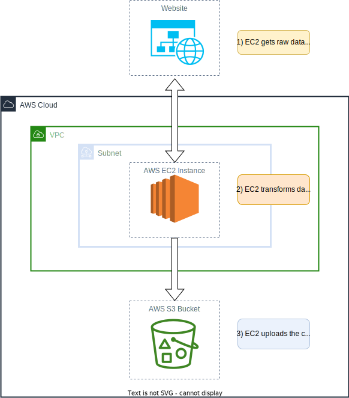

# EC2 Mini Project




# Intro
This is a simple mini-project that uses an EC2 instance to extract data from a website (https://www.themuse.com/api/public/jobs?page=1), transforms the data, and loads the data into a csv file that is then uploaded to an S3 bucket.

# How to run
## Requirements
To deploy the infrastructure and run the script as detailed below, you need to have the following installed:
1. AWS CLI -- it should also be configured
2. AWS SAM (Severless Application Model) -- this is the IaC (Infrastructure as Code) tool used in this project


## Step 1. Build and deploy infrastructure to AWS
```bash
sam build
sam deploy --config-file samconfig.toml
```

## Main Resources Created In This Projectgit push -u origin main
1. EC2 Instance
2. VPC
3. Subnet
4. Security Group
5. Internet Gateway
6. IAM Instance Profile
7. Route Table


## Cleanup
To delete this sample application after testing it out, you can use the following AWS CLI command.

```bash
sam delete-stack --stack-name ec2-mini-project
```
